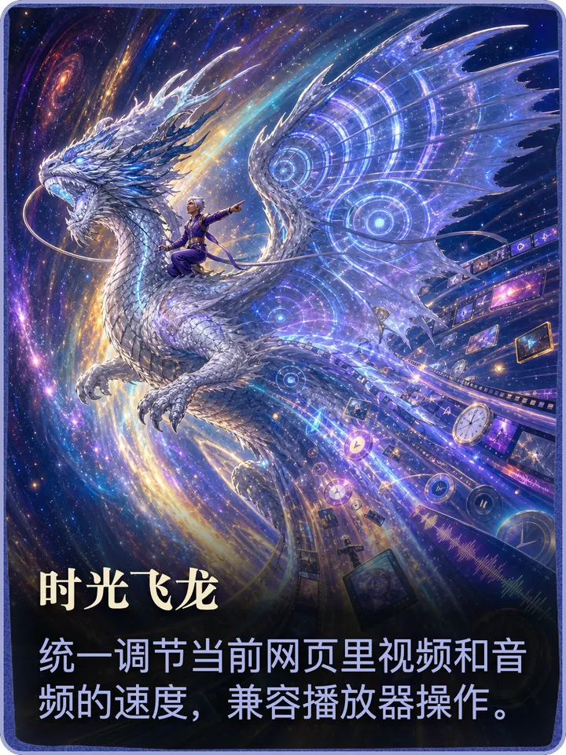
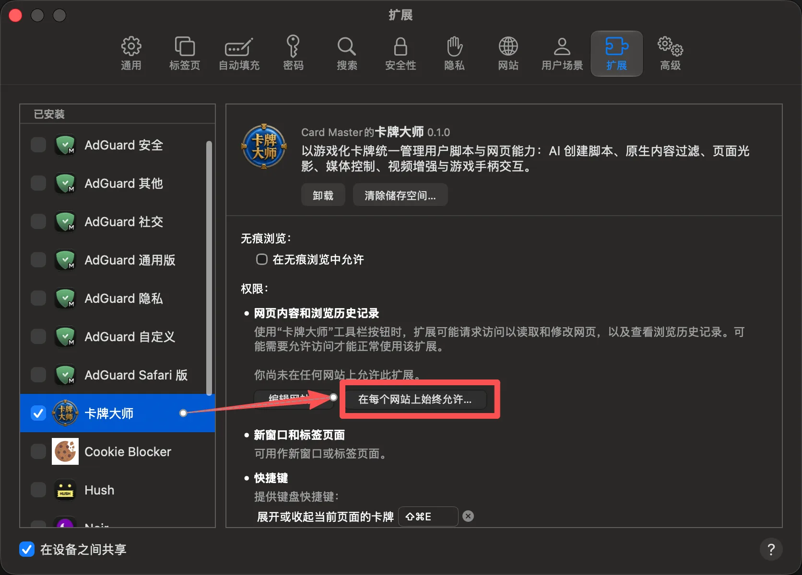

<div align="center">
  

  <h1>卡牌大师</h1>

  <p><a href="https://www.bilibili.com/video/BV12PtF6mEr4/"><strong>观看林亦LYi 官方介绍视频</strong></a></p>

  <p><strong>以游戏化卡牌统一管理用户脚本与网页能力。</strong></p>
  <p>AI 脚本生成 · 内容过滤 · 深色主题 · 媒体控制 · 视频增强 · 游戏手柄</p>

  <p>
    <a href="https://github.com/LYiHub/Card-master-browser-extension-public/releases/latest">
      
    </a>
    <a href="./LICENSE">
      
    </a>
    
  </p>

  <p>
    <a href="https://github.com/LYiHub/Card-master-browser-extension-public/releases/latest"><strong>下载发布版</strong></a>
    ·
    <a href="https://github.com/LYiHub/Card-master-browser-extension-public/issues">问题反馈</a>
    ·
    <a href="https://space.bilibili.com/4401694">林亦LYi B站主页</a>
    ·
    <a href="./THIRD_PARTY_NOTICES.md">第三方声明</a>
  </p>
</div>

## 视觉一览

<p align="center">
  
</p>

<p align="center">
  
  
  
  
</p>

<p align="center"><sub>卡背 · 杀 · 时光飞龙 · 了不起的脚本小子</sub></p>

## 核心能力

- 📜 **用户脚本** — 安装、导入、更新、启停、隐藏；新装默认启用
- ✨ **AI 脚本工坊** — 搜索、创建、解释、修复；兼容 Responses 与 Chat Completions
- 🖼️ **新标签页** — AI 每日回顾壁纸、电子相框和搜索 · *Chromium / Firefox*
- ⚔️ **杀** — 点选隐藏广告或其他内容
- 🌙 **暗夜降临** — 重算页面明暗 · 新装默认停用
- 🐉 **时光飞龙** — 统一调节网页音视频速度
- 🐑 **顺手牵羊** — 发现并取得页面媒体 · *Chromium / Firefox*，新装默认停用
- 🎬 **视频增强** — 流量探险家、合成大弹幕、绯红空降，以及 B 站 / YouTube SponsorBlock
- 🎮 **科乐美秘技** — 鼠标、键盘、手柄一套操作；含屏幕键盘、拼音和语音

同一套核心代码打 Chromium、Firefox、Safari 三份包。

## 安装

到 [Releases](https://github.com/LYiHub/Card-master-browser-extension-public/releases/latest)
下载对应 zip，并核对 `SHA256SUMS.txt`。

> 这些 zip **不是安装包**。Chromium 内核浏览器和 Firefox 必须先解压，再加载那个
> 带 `manifest.json` 的文件夹。

| 平台 | 产物 | 加载方式 |
| --- | --- | --- |
| Chromium（Chrome、Edge、Brave、Arc 等） | `card-master-v*-chromium.zip` | 解压 → 加载未打包扩展 |
| Firefox | `card-master-v*-firefox.zip` | 解压 → 临时载入附加组件 |
| macOS Safari | `card-master-v*-safari-macos.zip` | 打开 `Card Master.app` → 在 Safari 里授权 |

### Chromium

1. 解压 `card-master-v*-chromium.zip`。
2. 打开扩展管理页（Chrome 为 `chrome://extensions`，其他 Chromium 浏览器路径类似）。
3. 打开右上角「开发者模式」。
4. 「加载未打包的扩展程序」→ 选中解压后的文件夹。
5. 打开扩展详情，开启「允许运行用户脚本」，再重新加载扩展。

> **不打开「允许运行用户脚本」，所有用户脚本都不会跑**，包括预装脚本。
> 路径：扩展管理页 → 卡牌大师 → 详情。

<details>
<summary>查看开关位置</summary>

<p align="center">
  
</p>

</details>

某个网站显示「未允许」时，点扩展图标或详情里的「有权访问的网站」，允许当前站或所有站。

### Firefox

解压后打开 `about:debugging#/runtime/this-firefox`，选「临时载入附加组件」，
再选目录里的 `manifest.json`。弹出用户脚本权限时请允许。

### Safari

打开 `Card Master.app` 之后，还要在 Safari 里勾完权限。只开 App、不授权网站，
网页上不会出现牌阵。

1. Safari → 设置 → 扩展 → 勾选「卡牌大师」。
2. 点 **在每个网站上始终允许…**，确认对所有网站允许。
3. 更新或重装后，先完全退出 Safari 再打开。

牌阵快捷键是 <kbd>⌘⇧E</kbd>。Safari 没有 Chromium 那项用户脚本开关，脚本走扩展自带注入。

<details>
<summary>查看「在每个网站上始终允许」位置</summary>

<p align="center">
  
</p>

</details>

<details>
<summary>Safari 没有新标签页和顺手牵羊</summary>

Safari 网页扩展没有 `history`、`bookmarks`、`topSites`、`downloads` 和完整
`webRequest`。每日回顾读不到浏览历史，顺手牵羊也没有可运行的上游实现，
所以这两张卡和相关页面都不会出现。不是漏装。

</details>

## 从源码构建

需要 Node.js 22+ 和 pnpm 11.18.0。

```bash
pnpm install --frozen-lockfile
pnpm check
pnpm extension:package --platform=all
```

产物在 `extension-dist/`。

## 参与贡献

用 [Issues](https://github.com/LYiHub/Card-master-browser-extension-public/issues)
提问题和建议。提交代码前请跑通 `pnpm check`，并保持改动范围可验证。

## 致谢

直接依赖、嵌入运行时、预装脚本和许可证见
[`upstreams.json`](./upstreams.json) 与
[`THIRD_PARTY_NOTICES.md`](./THIRD_PARTY_NOTICES.md)。

<details>
<summary>查看完整第三方项目列表</summary>

- **内容过滤与页面能力**：
  [AdGuard tsurlfilter](https://github.com/AdguardTeam/tsurlfilter)、
  [AdGuard DNR Rulesets](https://github.com/AdguardTeam/DnrRulesets)、
  [Dark Reader](https://github.com/darkreader/darkreader)、
  [Video Speed Controller](https://github.com/igrigorik/videospeed)、
  [Speeder](https://github.com/SoPat712/Speeder)、
  [Hayame](https://github.com/atani/hayame)、
  [Cat Catch](https://github.com/xifangczy/cat-catch)。
- **用户脚本平台参考**：
  [Violentmonkey](https://github.com/violentmonkey/violentmonkey)、
  [Tampermonkey historical source](https://github.com/Tampermonkey/tampermonkey)、
  [ScriptCat](https://github.com/scriptscat/scriptcat)。
- **Bilibili 与 YouTube**：
  [TabulaBili](https://github.com/tjsky/TabulaBili)、
  [pakku.js](https://github.com/xmcp/pakku.js)、
  [BilibiliSponsorBlock](https://github.com/hanydd/BilibiliSponsorBlock)、
  [SponsorBlock](https://github.com/ajayyy/SponsorBlock)、
  [BiliKit](https://github.com/shiinayane/BiliKit)、
  [Bilibili Favorites Fix](https://github.com/crnkv/bilibili-favorites-fix-cerenkov-mod)、
  [Copying Lifted](https://github.com/canguser/hooker-js)。
- **手柄、导航与输入**：
  [Remapad](https://github.com/Shin-Aska/remapad)、
  [Gaming Controller Tester](https://github.com/pmanikas/gaming-controller-tester)、
  [Spatial Nav CSS](https://github.com/SauceTaster/spatial-nav-css)、
  [Pinyin IME](https://github.com/catcherinsky/pinyin-ime)、
  [Lumno](https://github.com/kubai087/lumno-extension)。
- **运行时与工具链**：
  [React](https://github.com/facebook/react)、
  [Lucide](https://github.com/lucide-icons/lucide)、
  [GSAP](https://github.com/greensock/GSAP)、
  [Acorn](https://github.com/acornjs/acorn)、
  [react-markdown](https://github.com/remarkjs/react-markdown)、
  [remark](https://github.com/remarkjs/remark)、
  [rehype](https://github.com/rehypejs/rehype)、
  [tldts](https://github.com/remusao/tldts)、
  [Cinzel](https://github.com/NDISCOVER/Cinzel)、
  [TypeScript](https://github.com/microsoft/TypeScript)、
  [Vite](https://github.com/vitejs/vite)、
  [Vitest](https://github.com/vitest-dev/vitest)、
  [Biome](https://github.com/biomejs/biome)、
  [esbuild](https://github.com/evanw/esbuild)、
  [sharp](https://github.com/lovell/sharp)。

卡牌式信息层级、牌阵和动效语言参考了包括 GWENT 在内的收藏卡牌游戏界面研究。
GWENT 及其相关名称、商标与官方素材归 CD PROJEKT RED 所有；Card Master 与其
不存在从属、授权或背书关系。

</details>

## 关于林亦LYi

卡牌大师由 [林亦LYi](https://space.bilibili.com/4401694) 团队策划与开发，
是林亦LYi 自媒体内容与开源实验的一部分。欢迎前往 B 站主页关注我们的视频与后续项目。

## 许可证

代码与第一方媒体资产以 [GPL-3.0-only](./LICENSE) 发布。第三方代码、数据、字体与预装脚本仍受各自许可证约束，见
[`THIRD_PARTY_NOTICES.md`](./THIRD_PARTY_NOTICES.md)。
